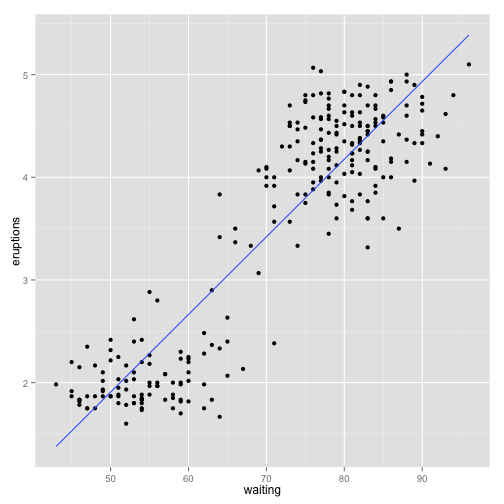

## Background

- This presentation introduces you to a brand new Shiny App created for the *Developing Data Products* class on Coursera

- In this presentation you'll:
  - Learn about what the app is and how to use it;
  - Take a look at the data used to develop the app; and
  - See where to access and use the app

---

## Description of the App

**What does the app do?**
- The app predicts the duration of an eruption for the Old Faithful geyser in Yellowstone National Park in Wyoming, USA
- The prediction is based on waiting time between eruptions
- Both the input (waiting time) and the prediction output are measured in minutes
- The app was developed using the *faithful* dataset from the **datasets** package

**How do I use the app?**
- Access the app via the link provided on *Slide 5*
- Input a numeric value for the waiting time between eruptions
- Hit the **Submit** button
- View and be entertained by the predicted duration of the eruption (result is in minutes)
- The minimum meaningful waiting time accepted by the model is 25 minutes and the maximum is unbounded.

---

## The Data Behind the Prediction Model


```r
library(ggplot2); data("faithful")
ggplot(faithful, aes(waiting, eruptions)) + geom_point() + geom_smooth(method=lm, se=FALSE)
```

 

---

## Where do I access the app?

- <https://mtmitchell13.shinyapps.io/courseraDataProducts>

- Enjoy!
